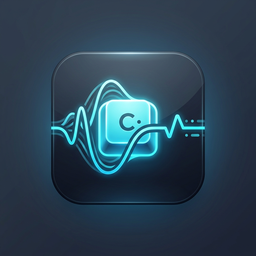

# CadenceSync

<p align="center">
  
</p>

An open-source Windows system tray app that dynamically adjusts Spotify playback tempo to match your typing speed (Keystrokes Per Minute).

---

## ⚡ Quick Download

You can download the pre-compiled Windows installer (`CadenceSync_Installer.exe`) directly from the **[GitHub Releases](https://github.com/theshashankk/CadenceSync/releases)** page to run the application immediately without local compilation.

---

## Features
- **Dynamic Tempo Matching**: Tracks your KPM over a rolling 60-second sliding window and switches Spotify playlists when you enter different tempo states:
  - **Calm/Debugging Mode** (< 80 KPM) ➡️ Low-tempo music (Lofi beats).
  - **Flow State** (80 - 180 KPM) ➡️ Mid-tempo music (Chill study/work beats).
  - **Sprint Mode** (> 180 KPM) ➡️ High-tempo music (Synthwave/Retrowave).
- **API Debouncing**: Implements a 15-second debounce buffer to prevent spamming Spotify API endpoints during typing pauses or short bursts.
- **Windowless System Tray Client**: Runs quietly in the taskbar. Right-click to view active KPM, toggle tracking, force credentials authorization, or exit.
- **Robust Error Tolerancing**: Automatically resolves active player devices, transfers playback, and gracefully reports state warnings (e.g. no active device or missing credentials) directly in the tray tooltip and menu.

---

## 🛠️ Step 1: Spotify API Credentials Setup
To interact with Spotify, you must obtain a Client ID and Client Secret:
1. Navigate to the [Spotify Developer Dashboard](https://developer.spotify.com/dashboard) and log in with your Spotify account.
2. Click **Create App**.
3. Fill in the application details:
   - **App name**: `CadenceSync`
   - **App description**: `Typing speed to Spotify music tempo synchronizer.`
   - **Redirect URI**: `http://localhost:8080` (This is critical for OAuth capture).
4. Select the **Web API** API option (and check terms of service).
5. Click **Save**.
6. On the application details page, click **Settings** to view your **Client ID** and **Client Secret**.

---

## ⚙️ Step 2: Configure Environment Settings
1. Rename the template `.env.example` in the root folder to `.env`:
   ```cmd
   copy .env.example .env
   ```
2. Open `.env` and fill in your developer credentials:
   ```env
   SPOTIFY_CLIENT_ID=your_actual_client_id_here
   SPOTIFY_CLIENT_SECRET=your_actual_client_secret_here
   SPOTIFY_REDIRECT_URI=http://localhost:8080
   ```
3. *(Optional)* Override the default Spotify playlist URIs with your own favorite playlists:
   - To get a playlist URI: Open Spotify, click `...` on a playlist ➡️ **Share** ➡️ **Copy Spotify URI**.
   - Paste it under the corresponding fields: `SPOTIFY_PLAYLIST_CALM`, `SPOTIFY_PLAYLIST_FLOW`, `SPOTIFY_PLAYLIST_SPRINT`.

---

## 📦 Step 3: Local Compilation (Local Binary Build)
To ensure complete transparency and user trust, you can compile the executable yourself:
1. Open a Command Prompt (`cmd.exe`) in the `cadence-sync` directory.
2. Run the build script:
   ```cmd
   build.bat
   ```
   *This script checks for Python, automatically initializes a virtual environment (`.venv`), installs packages, and compiles the standalone executable using PyInstaller.*
3. Once completed, the standalone binary is generated at:
   `dist/CadenceSync.exe`

---

## 💾 Step 4: Building the Installer
To generate a standard Windows Installer:
1. Download and install [Inno Setup Compiler](https://jrsoftware.org/isinfo.php).
2. Open `installer.iss` in the Inno Setup Compiler.
3. Click **Build** ➡️ **Compile** (or press `Ctrl+F9`).
4. The installer package `CadenceSync_Installer.exe` will be generated in the root directory.
5. Run the installer to install CadenceSync with startup launching, desktop shortcuts, and uninstall setups.

---

## 🚀 Running CadenceSync

You can run CadenceSync either directly using Python or as a compiled standalone executable:

### Option A: Direct Python Run (No Compilation)
1. Double-click `run.bat` (or execute it via command line in the project folder).
2. *This automatically verifies dependencies and starts the app by running `python main.py` inside the virtual environment.*

### Option B: Standalone Executable
1. Run the compiled `dist/CadenceSync.exe` (from Step 3) or install via the generated installer (from Step 4).

---

## 🔑 Usage and Prerequisites

1. **Spotify Playback Prerequisites**:
   - Ensure you have **Spotify Premium** (required by Spotify Web API for playback control).
   - Open Spotify on your computer/phone and start playing *any* song (Spotify needs active playback context to accept play requests).
2. **Initial Authorization**:
   - Right-click the system tray icon and select **Force Refresh Spotify Token**.
   - Your browser will open a Spotify page asking you to authorize the application. Click **Agree**.
   - The browser page will redirect to `http://localhost:8080` showing a success message.
   - Credentials are now cached locally in `.cache` in the application directory.
3. **Pace-based Tempo Sync**:
   - Start typing! As your typing speed (KPM) shifts, the tray tooltip and menu status will update.
   - If your typing speed stays in a new speed bracket for more than 15 seconds, Spotify will automatically transition your playback to the configured playlist!
